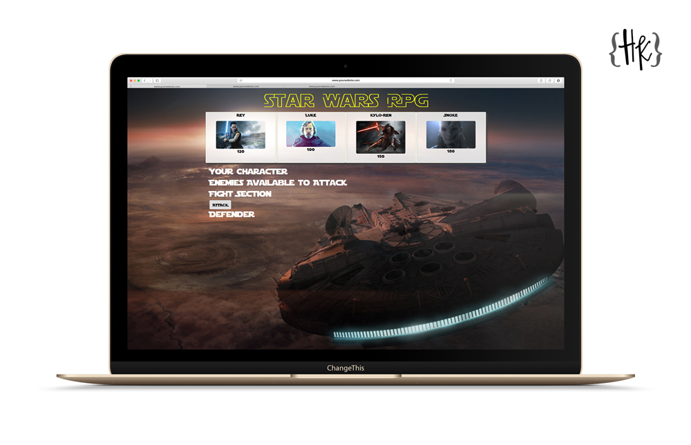

# Star-Wars-RPG

This is the Week 4 assignment from the UTM Full Stack Developer Bootcamp. I was tasked to create a game which will run in the browser and feature dynamically updated HTML and CSS and powered by my jQuery and JavaScript code.

## Tools Used

- HTML
- CSS
- Vanilla JavaScript
- jQuery
  - Click Events
  - Updating the DOM

## How to Play:

When the game loads you will be able to select from 4 Star Wars Characters. Each fighter has an Attack Score, Health Points and a possible Counter Attack.

You must defeat the 3 enemies to be crowned the strongest fighter.

## Support

If you find an error or bug please [let me know.](https://github.com/CopperCo/Star-Wars-RPG/issues)
